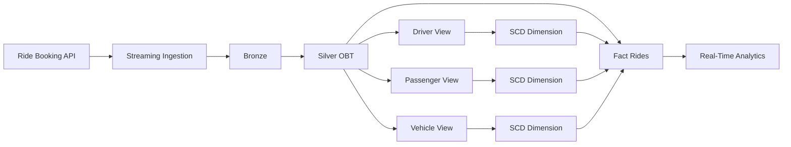
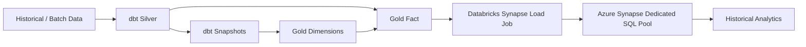
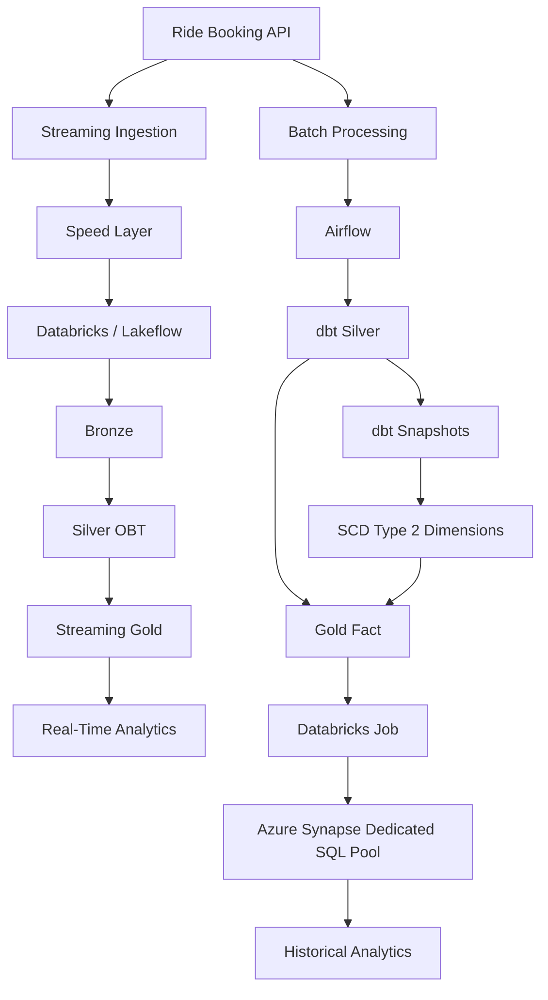
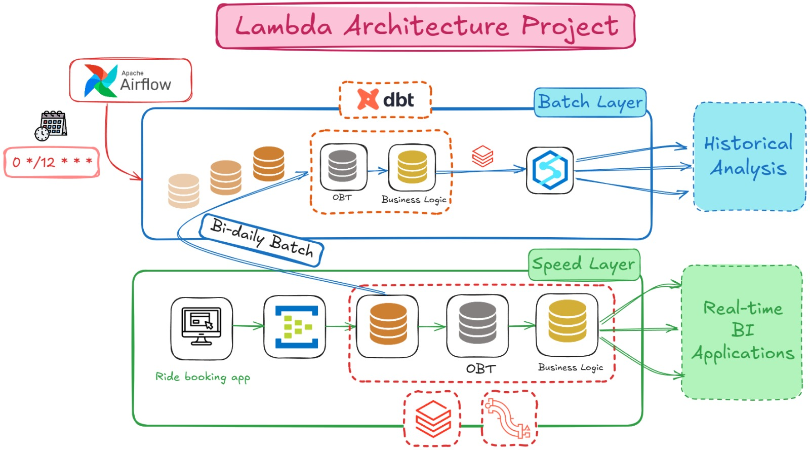
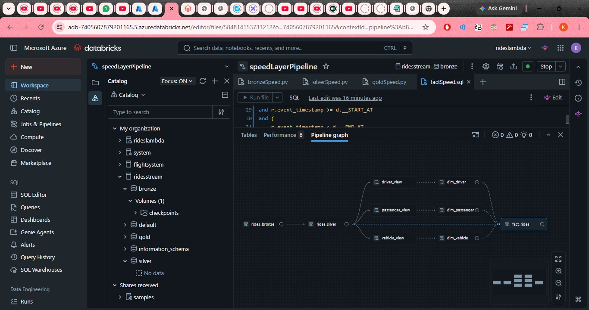
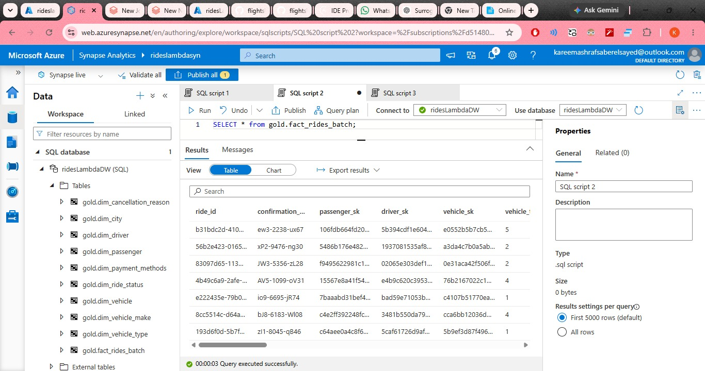

# 🚖 Ride Booking Lambda Architecture

An end-to-end **Lambda Architecture data engineering project** for a ride-booking platform, implementing separate **Speed and Batch processing layers** to support both real-time operational analytics and reliable historical analysis.

The project combines **Azure Databricks, Lakeflow Declarative Pipelines, Delta Lake, PySpark, dbt, Apache Airflow, and Azure Synapse Analytics** into a complete data platform.

---

# 🏗 Architecture

    

The platform follows a Lambda Architecture with two independent processing paths:

- **Speed Layer** for continuously arriving ride-booking events and low-latency analytics.
- **Batch Layer** for scheduled processing, historical recomputation, dimensional modeling, and analytical workloads.

Both layers ultimately provide curated data for downstream analytics.

---

# ⚡ Speed Layer

    

The Speed Layer is implemented using **Azure Databricks and Lakeflow Declarative Pipelines**.

Ride-booking events are continuously ingested into the Bronze layer and transformed through a medallion-style pipeline.

Speed Layer Processing
The streaming pipeline includes:
Continuous event ingestion
Delta Lake Bronze storage
Streaming transformations
Silver OBT processing
Streaming joins
Watermarks
Reference/mapping data
Dimension processing
CDC handling
SCD Type 1 / Type 2 dimensional logic
Gold fact construction
Lakeflow Declarative Pipelines dependency management
The resulting Gold layer provides data optimized for low-latency analytical and operational use cases.
#📦 Batch Layer
The Batch Layer provides a separate processing path for scheduled historical processing.
Apache Airflow is used as the orchestration layer, while dbt handles the transformation and dimensional modeling logic.

The Batch Layer intentionally provides an independent computation path from the Speed Layer.
This allows historical data to be processed and recomputed independently rather than relying exclusively on the continuously processed streaming results.
#🔄 dbt Transformation Layer
The Batch Layer uses dbt for SQL-based transformation and dimensional modeling.
The dbt project is responsible for
-Silver-layer transformation
-Incremental processing
-SCD Type 2 snapshots
-Dimension construction
-Surrogate key generation
-Historical dimension lookups
-Fact table construction
-Dependency management
-Data tests
-Environment-specific schema configuration
The core modeling flow is:
Bronze OBT
    │
    ▼
dbt Silver
    │
    ├───────────────┐
    ▼               ▼
Snapshots       Other transformations
    │
    ▼
SCD Type 2 Dimensions
    │
    ├───────────────┐
    │               │
    ▼               ▼
Dimensions      Fact Construction
                    │
                    ▼
              Gold Fact Table

SCD Type 2
The Batch Layer uses dbt snapshots to maintain historical versions of changing entities such as:
Drivers
Passengers
Vehicles
The resulting dimensions contain:
Surrogate keys
Business keys
Attribute values
valid_from
valid_to
Update timestamps
The fact model performs temporal joins against these dimensions so that each ride is associated with the correct historical version of the entity at the time the ride occurred.
Example:
r.event_timestamp >= d.valid_from
AND (
    r.event_timestamp < d.valid_to
    OR d.valid_to IS NULL
)
This allows historical changes to driver, passenger, and vehicle attributes to be preserved without overwriting previous versions.

##🧠 Dimensional Model
The Gold layer follows a dimensional/star-schema approach.
Dimensions
dim_driver
dim_passenger
dim_vehicle
dim_vehicle_type
dim_vehicle_make
dim_city
dim_payment_methods
dim_ride_status
dim_cancellation_reason
Fact
fact_rides_batch
The fact table stores surrogate keys for the SCD dimensions while retaining the ride-level measures and descriptive foreign keys required for analytical workloads.
⏱ Orchestration
Apache Airflow orchestrates the Batch Layer workflow.
The intended execution flow is:
Scheduled Airflow DAG
        │
        ▼
   dbt Silver
        │
        ▼
   dbt Snapshots
        │
        ▼
    dbt Gold
        │
        ▼
Databricks Job
        │
        ▼
Synapse Load
Airflow is responsible for coordinating the workflow and enforcing dependencies between processing stages.
The Databricks Job is responsible for the Databricks-to-Synapse loading operation.
The project is designed to run through Astronomer Cloud for managed Airflow orchestration.
#🏢 Azure Synapse Serving Layer

The curated Batch Gold data is loaded into an Azure Synapse Dedicated SQL Pool for downstream analytical workloads.
The Synapse warehouse contains the dimensional model and batch fact table:
gold
│
├── dim_cancellation_reason
├── dim_city
├── dim_driver
├── dim_passenger
├── dim_payment_methods
├── dim_ride_status
├── dim_vehicle
├── dim_vehicle_make
├── dim_vehicle_type
└── fact_rides_batch
The Synapse layer acts as the analytical serving layer for historical reporting and warehouse-style workloads.
#🧩 End-to-End Data Flow:

#🛠 Technology Stack

-Cloud:
Microsoft Azure

-Streaming Compute:
Azure Databricks

-Batch Compute:
Azure Databricks

-Streaming Framework:
Lakeflow Declarative Pipelines

-Processing:
PySpark

-Transformation:
dbt

-Orchestration:
Apache Airflow

-Storage Format:
Delta Lake

-Streaming Storage:
Databricks Delta Tables

-Data Modeling:
Dimensional / Star Schema
CDC / History
SCD Type 1 & Type 2

-Warehouse:
Azure Synapse Dedicated SQL Pool

-Query Language:
SQL

-Programming:
Python / PySpark / SQL

-Source:
Ride Booking API

#✨ Key Engineering Features
Lambda Architecture
Independent Speed and Batch processing paths
Real-time processing for low-latency use cases
Batch processing for historical recomputation
Separate serving requirements for operational and analytical workloads
Streaming Data Engineering
Continuous event ingestion
Lakeflow Declarative Pipelines
Delta Lake
Bronze → Silver → Gold processing
Streaming transformations
Watermarks
Streaming joins
Reference/mapping data
CDC processing
Batch Data Engineering
Scheduled batch processing
dbt-based transformation
Incremental Silver model
dbt snapshots
SCD Type 2 dimensions
Historical temporal joins
Surrogate keys
Dimensional modeling
Gold fact construction
Orchestration
Apache Airflow
Task dependencies
Scheduled execution
dbt workflow orchestration
Databricks Job triggering
Synapse loading
Data Warehouse
Azure Synapse Dedicated SQL Pool
Dedicated analytical serving layer
Star schema
Fact and dimension tables
Historical analytical workloads

#📁 Project Structure:
ridesLambda/
│
├──  Ride Booking API and generated source data
│
├── speed_layer/
│   └── Databricks / Lakeflow Declarative Pipelines
│
├── batch_layer/
│   ├── dags/
│   │   └── Airflow DAGs
│   │
│   ├── dbt/
│   │   └── lambdaBatchSG/
│   │       ├── models/
│   │       ├── snapshots/
│   │       ├── macros/
│   │       ├── tests/
│   │       └── dbt_project.yml
│   │
│   ├── Synapse loading notebook
│   │
│   └── requirements.txt
│
├── screenshots/
│   ├── architecture.png
│   ├── databricks_speed_layer.png
│   └── synapse_gold_tables.png
│
└── README.md

#📸 Implementation Screenshots
#Lambda Architecture

    

#Databricks Speed Layer
Lambda Architecture

    

#Synapse Analytical Warehouse

    

#🎯 Project Goals
This project was designed to demonstrate an end-to-end data engineering platform rather than an isolated transformation pipeline

it combines:
Data Generation
      ↓
Streaming Ingestion
      ↓
Speed Layer
      ↓
Delta Lake
      ↓
Batch Processing
      ↓
dbt Transformation
      ↓
SCD Type 2
      ↓
Dimensional Modeling
      ↓
Airflow Orchestration
      ↓
Databricks Processing
      ↓
Synapse Data Warehouse

The resulting architecture supports both low-latency operational analytics and historically consistent analytical workloads while keeping the streaming and batch processing paths independently maintainable.
